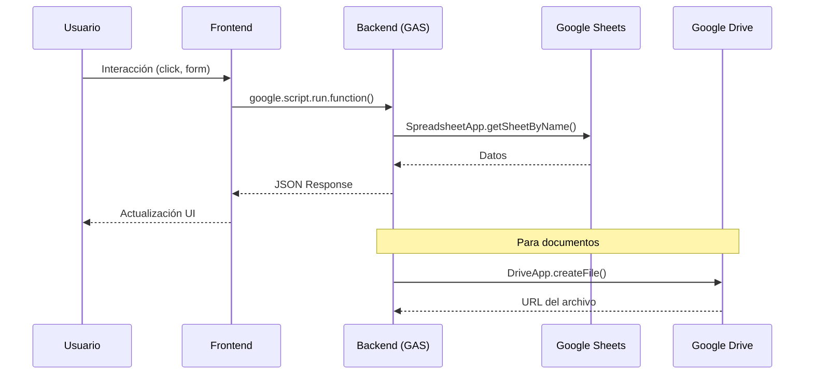

# Arquitectura del Sistema SG-SST

## Visión General

Sistema de gestión SG-SST (Seguridad y Salud en el Trabajo) para Colombia, construido con tecnología Google Stack de bajo costo.

---

## Diagrama de Arquitectura

```
┌─────────────────────────────────────────────────────────────────┐
│                        FRONTEND LAYER                           │
│                    (HTML / CSS / JavaScript)                    │
│  ┌──────────┐ ┌──────────┐ ┌──────────┐ ┌──────────┐           │
│  │Dashboard │ │Empresas  │ │Empleados │ │Documentos│           │
│  └──────────┘ └──────────┘ └──────────┘ └──────────┘           │
│  ┌──────────┐ ┌──────────┐                                      │
│  │ Alertas  │ │ Reportes │                                      │
│  └──────────┘ └──────────┘                                      │
└────────────────────────────┬────────────────────────────────────┘
                             │ HTTP / JSON
                             ▼
┌─────────────────────────────────────────────────────────────────┐
│                       BACKEND LAYER                             │
│                    (Google Apps Script)                         │
│                                                                 │
│  ┌─────────────┐ ┌─────────────┐ ┌─────────────┐               │
│  │ Empresas.gs │ │Empleados.gs │ │Documentos.gs│               │
│  └─────────────┘ └─────────────┘ └─────────────┘               │
│  ┌─────────────┐ ┌─────────────┐ ┌─────────────┐               │
│  │ Alertas.gs  │ │ Acciones.gs │ │ Usuarios.gs │               │
│  └─────────────┘ └─────────────┘ └─────────────┘               │
│  ┌─────────────┐ ┌─────────────┐ ┌─────────────┐               │
│  │ Reportes.gs │ │   API.gs    │ │  Utils.gs   │               │
│  └─────────────┘ └─────────────┘ └─────────────┘               │
└────────────────────────────┬────────────────────────────────────┘
                             │ SpreadsheetApp / DriveApp
                             ▼
┌─────────────────────────────────────────────────────────────────┐
│                        DATA LAYER                               │
│                                                                 │
│  ┌───────────────────────────┐  ┌───────────────────────────┐  │
│  │     Google Sheets         │  │      Google Drive         │  │
│  │  ┌─────────────────────┐  │  │  ┌─────────────────────┐  │  │
│  │  │ empresas            │  │  │  │ /SG-SST/Documentos  │  │  │
│  │  │ empleados           │  │  │  │ /SG-SST/Reportes    │  │  │
│  │  │ documentos_sst      │  │  │  └─────────────────────┘  │  │
│  │  │ alertas             │  │  └───────────────────────────┘  │
│  │  │ acciones            │  │                                 │
│  │  │ usuarios            │  │                                 │
│  │  └─────────────────────┘  │                                 │
│  └───────────────────────────┘                                 │
└─────────────────────────────────────────────────────────────────┘
```

---

## Principios de Diseño

| Principio | Descripción |
|-----------|-------------|
| **Multi-empresa** | Gestión de múltiples empresas en una sola instancia |
| **Bajo costo** | Solo herramientas gratuitas de Google |
| **Trazabilidad** | Toda acción queda registrada con fecha y usuario |
| **Auditable** | Estructura clara para inspecciones legales |
| **Relacional lógico** | Relaciones manejadas en Apps Script, no en Sheets |

---

## Restricciones Técnicas

- ❌ No usar Gmail ni servicios de correo
- ❌ No automatizar envío de WhatsApp
- ❌ No usar APIs externas complejas
- ❌ No editar datos críticos manualmente en Sheets
- ✅ WhatsApp solo con botón manual (enlace prefijado)
- ✅ Exportación a PDF y Excel

---

## Flujo de Datos



---

## Seguridad

1. **Aislamiento de datos**: Cada query filtra por `empresa_id`
2. **Validación**: Backend valida todos los datos antes de guardar
3. **Roles**: admin / operador / consulta
4. **Auditoría**: Tabla `acciones` registra todas las operaciones críticas
